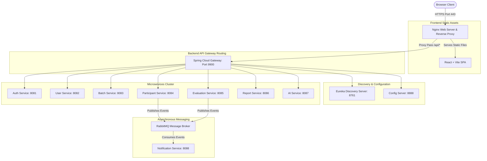
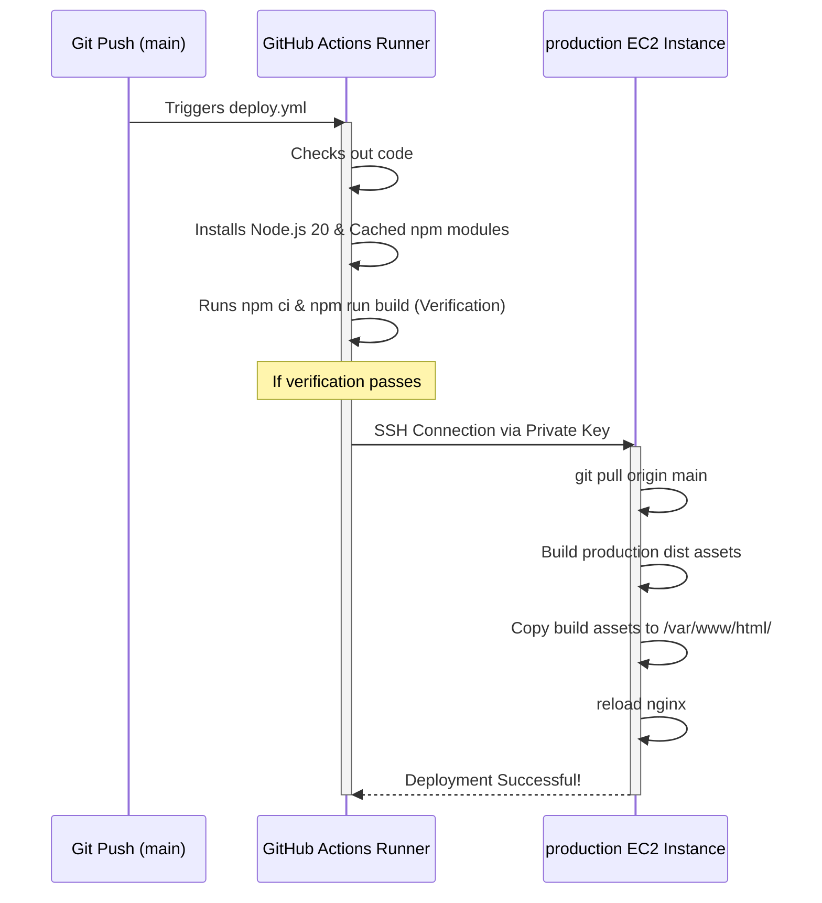

# EvalTrack: Mock Evaluation System

A robust, production-grade enterprise platform for the **NexaNova Mock Evaluation Management System**, engineered with a modern Spring Boot Microservices Architecture for the backend and a premium React + TypeScript frontend.

EvalTrack is designed to streamline technical training academies by automating the entire lifecycle of mock evaluations. From organizing training batches and assigning evaluators to multi-round scoring, generating AI-powered holistic performance reports, and providing real-time secure communication, this system provides a highly scalable and fault-tolerant foundation.

---

## 🏗️ System Architecture Overview



---

## 🚀 Key Features & Core Workflows

### 1. Administrative Operations
* **Batch & Technology Control:** Admins manage training batches, define technology stacks (e.g., Java, Python, React), and configure evaluation rounds.
* **Participant Enrollment:** Admins manage profiles and enroll students into specific batch-technologies.
* **Evaluator Assignment:** Admins assign qualified evaluators to specific participants for specific rounds with balanced workload distribution.
* **Dynamic Search & Pagination:** Premium, real-time client-side and server-side filtering for batches, users, participants, enrollments, and assignments, including client-side pagination fallback for flat endpoints.

### 2. Evaluator Operations
* **Assignment Tracking:** Evaluators receive personalized dashboards to view pending assignments.
* **Dynamic Scoring:** Evaluators input quantitative scores (0-10) and comprehensive qualitative feedback.

### 3. Reporting & AI Integration
* **Aggregated Reports:** Synthesizes scores across all rounds to construct comprehensive metrics.
* **AI-Powered Insights:** Integrated with OpenRouter (DeepSeek V3), the AI service analyzes scores and qualitative comments to generate holistic strengths and growth paths.
* **Asynchronous Notifications:** Dispatches transactional email notifications in the background using RabbitMQ and Spring Boot Mail.

---

## 🛠️ Technology Stack

### Backend Microservices
* **Core Framework:** Java 17, Spring Boot 3.2.3, Spring Cloud 2023.0.0 (Eureka, Config, Gateway, OpenFeign)
* **Message Broker:** RabbitMQ (for event-driven asynchronous operations)
* **Caching & Rate Limiting:** Redis Reactive (Gateway IP rate-limiting)
* **Databases:** PostgreSQL 15 (dedicated databases per service to guarantee domain isolation)

### Frontend Application
* **Core Framework:** React 18, TypeScript, Vite 5.x
* **Styling & Responsive Design:** Tailwind CSS with custom editorial minimalist themes and layout shells matching all screen sizes (mobile, tablet, desktop).
* **Network Client:** Axios with dynamic JWT interceptors.

---

## 📦 Build & Development Instructions

### 1. Backend Microservices Build
To compile the Java microservices and build standard executable JAR files:
1. Ensure Java 17 and Maven 3.8+ are installed.
2. Navigate to the `Backend` directory:
   ```bash
   cd Backend
   ```
3. Run the full Maven package lifecycle (skipping tests for speed):
   ```bash
   mvn clean package -DskipTests
   ```
4. Build and start the entire Docker container cluster locally:
   ```bash
   docker-compose up --build -d
   ```

### 2. Frontend Development & Build
1. Navigate to the `Frontend` directory:
   ```bash
   cd Frontend
   ```
2. Install dependencies matching the package lockfile:
   ```bash
   npm ci
   ```
3. Run the local development server:
   ```bash
   npm run dev
   ```
4. Compile the production bundle:
   ```bash
   npm run build
   ```
   *This generates clean, minified static HTML, JS, and CSS files under `Frontend/dist/`.*

---

## 🌐 Production Deployment Guide (AWS EC2 & Nginx)

This guide documents the enterprise-grade production environment deployed on the **AWS EC2 instance** (`13.202.248.158`) serving **`https://evaltrack.online`**.

### 1. Nginx Web Server Setup
Nginx acts as both the static web host for the compiled React SPA and a secure reverse proxy for all API requests.

* **Frontend Web Directory:** `/var/www/html/` (contains files copied from `Frontend/dist/` after compiling).
* **Nginx Configuration:** Located at `/etc/nginx/sites-available/default`.

```nginx
server {
    server_name evaltrack.online www.evaltrack.online;

    root /var/www/html;
    index index.html;

    # Frontend Routing Fallback (prevents 404 on browser refresh)
    location / {
        try_files $uri $uri/ /index.html;
    }

    # Secure API Reverse Proxy (avoids Mixed Content and CORS issues)
    location /api/ {
        proxy_pass http://127.0.0.1:9900;
        proxy_set_header Host $host;
        proxy_set_header X-Real-IP $remote_addr;
        proxy_set_header X-Forwarded-For $proxy_add_x_forwarded_for;
        proxy_set_header X-Forwarded-Proto $scheme;
    }

    listen 443 ssl; # managed by Certbot
    ssl_certificate /etc/letsencrypt/live/evaltrack.online/fullchain.pem; # managed by Certbot
    ssl_certificate_key /etc/letsencrypt/live/evaltrack.online/privkey.pem; # managed by Certbot
    include /etc/letsencrypt/options-ssl-nginx.conf; # managed by Certbot
    ssl_dhparam /etc/letsencrypt/ssl-dhparams.pem; # managed by Certbot
}

server {
    if ($host = www.evaltrack.online) {
        return 301 https://$host$request_uri;
    } # managed by Certbot

    if ($host = evaltrack.online) {
        return 301 https://$host$request_uri;
    } # managed by Certbot

    listen 80;
    server_name evaltrack.online www.evaltrack.online;
    return 404; # managed by Certbot
}
```

### 2. HTTPS & SSL Certificate Configuration
Let's Encrypt certificates are configured on the EC2 server using Certbot:
1. **Installation:**
   ```bash
   sudo apt update
   sudo apt install certbot python3-certbot-nginx -y
   ```
2. **Generation & Automatic Configuration:**
   ```bash
   sudo certbot --nginx -d evaltrack.online -d www.evaltrack.online
   ```
3. **Auto-Renewal Verification:**
   ```bash
   sudo certbot renew --dry-run
   ```
   *Certbot automatically installs a systemd timer background task to renew the certificate before it expires.*

---

## 🔄 CI/CD Automation (GitHub Actions)

An automated deployment pipeline is configured in `.github/workflows/deploy.yml` to compile and deploy frontend changes automatically upon every push to the `main` branch.

### 1. Required GitHub Secrets
Configure the following secrets under **Settings ➔ Secrets and variables ➔ Actions** in your GitHub repository:
* `EC2_HOST`: The public IP of your EC2 instance (`13.202.248.158`).
* `EC2_USER`: The default EC2 SSH user (`ubuntu`).
* `SSH_PRIVATE_KEY`: The complete contents of your private SSH key (`.pem` file).

### 2. Deployment Workflow Diagram


### 3. Workflow File Details
The workflow automatically checks for changes in the `Frontend/` folder, verifies compilation, and pushes securely to the EC2 server:

```yaml
name: Deploy EvalTrack Frontend

on:
  push:
    branches:
      - main
    paths:
      - 'Frontend/**'
      - '.github/workflows/deploy.yml'

jobs:
  build-and-test:
    name: Build & Verify
    runs-on: ubuntu-latest

    steps:
      - name: Checkout Code
        uses: actions/checkout@v3

      - name: Set up Node.js
        uses: actions/setup-node@v3
        with:
          node-version: 20
          cache: 'npm'
          cache-dependency-path: Frontend/package-lock.json

      - name: Install Dependencies
        run: |
          cd Frontend
          npm ci

      - name: Verify Production Build
        run: |
          cd Frontend
          npm run build

  deploy:
    name: Deploy to Production
    needs: build-and-test
    runs-on: ubuntu-latest

    steps:
      - name: Execute Remote Deploy via SSH
        uses: appleboy/ssh-action@master
        with:
          host: ${{ secrets.EC2_HOST }}
          username: ${{ secrets.EC2_USER }}
          key: ${{ secrets.SSH_PRIVATE_KEY }}
          script: |
            echo "==== Starting Deployment on EC2 ===="
            cd ~/NexaNova-Task-3
            
            echo "Fetching latest changes from main branch..."
            git pull origin main
            
            echo "Building production assets..."
            cd Frontend
            npm install
            npm run build
            
            echo "Copying static assets to web directory..."
            sudo cp -r dist/* /var/www/html/
            
            echo "Reloading Nginx server..."
            sudo systemctl reload nginx
            
            echo "==== Deployment Completed Successfully! ===="
```
